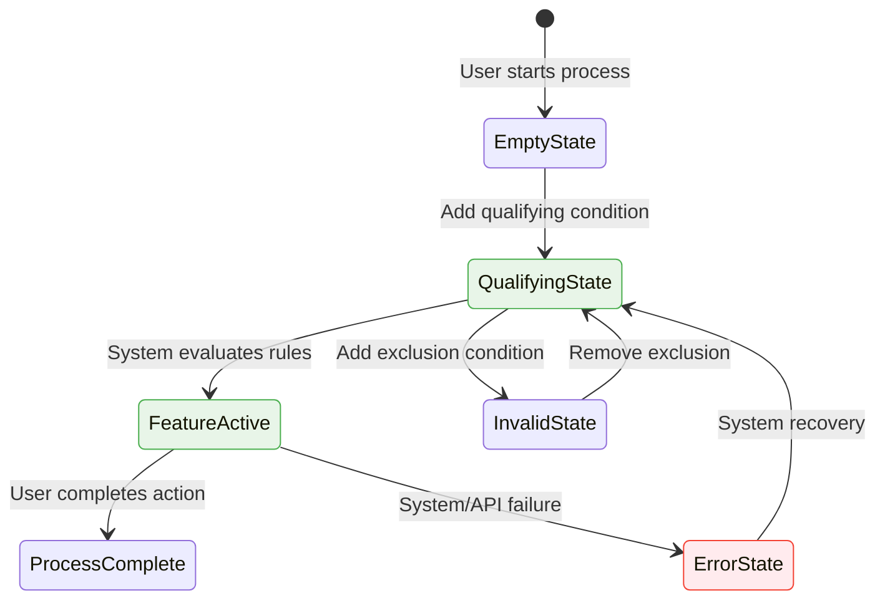

# QA Test Scenarios Generation Prompt (YouTrack MCP + Figma MCP)

## 🚨 CRITICAL FILE READING REQUIREMENTS
**MANDATORY:** This prompt must be read COMPLETELY using:
1. `wc -l MCP_YouTrack_AI_Promt.md` (record actual line count)
2. `Bash: cat MCP_YouTrack_AI_Promt.md` (read entire file - verify no truncation)
3. Verify all 3 main sections covered: File Analysis + MCP Integration + QA Framework
4. Confirm `cat` output matches `wc -l` count (complete read verification)

**🚨 BLOCKING REQUIREMENT:** If `cat` shows truncation or output incomplete, STOP and re-read before proceeding.

## 📋 MANDATORY QA DELIVERABLE REQUIREMENTS
**ALL 8 QA TECHNIQUES REQUIRED:**
1. **Equivalence Partitioning** - Entity classification tables
2. **Decision Table Testing** - 11+ column matrix with TC1-TC13+ cases
3. **State Transition Testing** - Mermaid diagrams + transition tests
4. **Boundary Value Analysis** - Quantity/limit boundaries
5. **Pairwise Testing** - Browser/customer/product matrices
6. **Error Guessing** - Systematic error prediction tables
7. **Exploratory Testing** - 3+ time-boxed charters (30-60 min each)
8. **Technical Validation** - API endpoints, SQL queries, database verification

**QUALITY GATES:**
- 67+ test scenarios minimum
- All bugs converted to prevention tests
- Cross-source validation (YouTrack ↔ Code ↔ Figma if available)
- Professional table format for all data

## 🎯 CORE QA MISSION & EXECUTION APPROACH
**PRIMARY GOAL:** Find business logic failures before customers do

**KEY QUESTION:** "How will this feature break in real customer scenarios?"

## 🔄 IMPROVED METHODOLOGY STRUCTURE

### STAGE 1: CORE ANALYSIS (ALWAYS MANDATORY)
**Data Sources:** YouTrack + Code + Related Bugs
1. **Execute pre-analysis verification** - File sizes, modification counts
2. **Load YouTrack task** with comments and bugs using MCP integration
3. **Complete code analysis** using universal pattern extraction protocol
4. **Apply all 8 QA techniques** with verification checklists
5. **Generate test scenarios document** with professional formatting

### STAGE 2: ENHANCEMENT MODULES (OPTIONAL)
#### Figma Module: `Figma_{TASK-ID}_Support.md`
- **Only if mockups available** and UI design critical
- **Execute all related MCP tools** for visual validation for all frames
- **Integrate UI test scenarios** into existing document

**SUCCESS PATTERN:** Core → Verify → Optional Enhance → Document → Deliver

---

# SECTION 1: COMPREHENSIVE DATA EXTRACTION

## 🔍 COMPLETE DATA EXTRACTION (CRITICAL)
**MANDATORY:** Extract ALL critical data from multiple sources:

### Universal Data Sources
| Source | Required Data | Validation Method |
|--------|---------------|------------------|
| **YouTrack Task** | Complete description, conditional statements, business rules | Word-by-word analysis |
| **Comments** | Statistical data (conversion rates, KPIs), edge cases | Quantitative extraction |
| **Bugs** | Root causes, reproduction steps, failure patterns | Prevention test creation |
| **Code** | Business logic, API endpoints, database parameters | Pattern analysis |
| **Figma** | Visual states, interaction flows, business rules | 4-tool MCP analysis |

### Statistical Data Extraction Patterns
**Search for in Comments:**
- Conversion rates: "X% conversion", "baseline Y%", "target Z%"
- Performance metrics: response times, success rates, KPIs
- Business justifications: revenue impact, measurement infrastructure
- Analytics requirements: tracking methods, database parameters

## ⚡ FAST BUSINESS LOGIC DISCOVERY

### 5-Minute Business Logic Extraction
| Pattern | Business Rule Type | QA Test Focus |
|---------|-------------------|---------------|
| **"ONLY if/when"** | Strict qualification rule | Test rule violations |
| **"NO [feature] when"** | Critical exclusion rule | Test exclusion scenarios |
| **"EXCEPT [condition]"** | Exception override rule | Test exception logic |
| **"MUST [action]"** | Mandatory business flow | Test flow interruptions |
| **"SHALL NOT [action]"** | Prohibited behavior | Test prohibition enforcement |

### QA Killer Questions
- **What input breaks this?** (Invalid data, edge values, null states)
- **What user behavior breaks this?** (Rapid clicks, back button, refresh)
- **What system state breaks this?** (Network fails, API down, DB timeout)
- **What integration breaks this?** (Service dependencies, auth failures)

## 📋 SYSTEMATIC EXTRACTION CHECKLISTS

### YouTrack Extraction Checklist
- [ ] All conditional statements extracted ("IF", "WHEN", "UNLESS", "EXCEPT", "ONLY IF")
- [ ] All negative requirements captured ("NO [feature]", "NOT supported", "EXCLUDE")
- [ ] All statistical data from comments (conversion rates, baselines, targets)
- [ ] All acceptance criteria identified (often scattered)
- [ ] All business rules with specific conditions documented

### Code Analysis Extraction Checklist  
- [ ] All qualification functions with complete logic AND line numbers
- [ ] All constants and configuration values WITH their exact values
- [ ] All API endpoints with HTTP methods AND their purposes
- [ ] All validation conditions in business logic WITH specific rules
- [ ] All database parameters and tracking mechanisms WITH schema details
- [ ] All error handling patterns and failure modes WITH recovery logic
- [ ] All React components WITH their props and state management
- [ ] All test methods converted to regression prevention scenarios

### Figma Analysis Extraction Checklist
- [ ] All visual states and UI variations
- [ ] All button text and interactions
- [ ] All numerical values and pricing displays
- [ ] All user type variations shown
- [ ] All error states and messages

## 🔄 INTEGRATED ANALYSIS APPROACH
**MANDATORY:** Treat all sources as single interconnected system

### Cross-Source Validation Matrix
| Validation Type | Requirements ↔ Source | Expected Consistency |
|----------------|----------------------|-------------------|
| **Requirements ↔ Figma** | Visual mockups match written requirements | UI states reflect business rules |
| **Code ↔ Requirements** | Implementation matches business rules | All requirements have code support |
| **Comments ↔ Figma** | Stakeholder clarifications align with designs | Mockups explain comment details |
| **All Sources ↔ Business** | Consistency across business rules and flows | No conflicts in business logic |

## 📁 MANDATORY CODE READING PROTOCOL (ZERO-FAILURE STANDARD)

### 🚨 MANDATORY PRE-ANALYSIS VERIFICATION
**EXECUTE EVERY TIME - NO EXCEPTIONS:**
```bash
wc -l TARGET_FILE                    # Step 1: Verify exact line count
ls -la TARGET_FILE                   # Step 2: Verify file size in bytes  
head -5 TARGET_FILE                  # Step 3: Verify file beginning
tail -5 TARGET_FILE                  # Step 4: Verify file end (no truncation)
```

### STRICT FILE READING PROTOCOL
| File Size | MANDATORY Method | Verification Required | Failure Consequences |
|-----------|-----------------|----------------------|----------------------|
| **<100 lines** | Read tool | ✅ Visual end-of-file confirmation | Re-read if incomplete |
| **100-1000 lines** | `Bash: cat` ONLY | ✅ Line count match + content boundaries | **CRITICAL FAILURE** |
| **1000+ lines** | `Bash: cat` ONLY | ✅ Search for EOF + section verification | **ANALYSIS INVALID** |
| **Patch files** | `Bash: cat` ONLY | ✅ File count + diff boundaries | **REQUIREMENTS MISSED** |

### 📋 PATCH FILE ANALYSIS PROTOCOL (MANDATORY EXECUTION)
**For ANY .patch/.diff file - SYSTEMATIC APPROACH REQUIRED:**

#### Phase 1: Patch Scope Discovery (MANDATORY)
```bash
wc -l PATCH_FILE                                      # Total lines (must note)
grep -c "^diff --git" PATCH_FILE                     # Modified files count
grep "^diff --git" PATCH_FILE                        # List ALL modified files
grep "^diff --git.*\.\(kt\|java\|ts\|tsx\|js\)$" PATCH_FILE | wc -l  # Code files count
```

#### Phase 2: Universal Pattern Extraction for Code Business Logic
**Focus on HIGH-PRIORITY business logic patterns, skip low-priority files:**
```bash
# PRIMARY: Extract core business logic patterns (works universally for any patch size)
grep -A20 -B5 "fun.*isQualified\|qualification\|isEligible" PATCH_FILE     # Business qualification logic
grep -A15 -B3 "@Controller\|@RestController\|@Get\|@Post" PATCH_FILE        # API endpoints architecture  
grep -A10 -B2 "ParameterNames\|Analytics\|EventLog\|FusLogger" PATCH_FILE   # Database/Analytics integration
grep -A12 -B3 "export.*Component\|Component.*Props" PATCH_FILE              # Frontend business components
grep -A8 -B2 "enum class\|const val.*=\|companion object" PATCH_FILE        # Business constants/configuration

# SECONDARY: Strategic multi-part reading for massive files (when patterns need more context)
head -n 1000 PATCH_FILE          # Beginning: Structure + imports + initial logic
head -n 1800 PATCH_FILE | tail -n 800    # Middle: Core business implementation  
tail -n 1200 PATCH_FILE          # End: Implementation details + integration

# SKIP LOW-PRIORITY: Focus analysis time on business logic, not infrastructure
# - Test files (*/test/*, *Test.kt, @Test methods) 
# - Config files (.yaml, .yml, openapi/, swagger/)
# - Assets (.svg, .png, .css, .scss)
# - Build config (webpack.config.js, package.json, tsconfig.json)
# - Translations (lang/*.json)
# - TypeScript definitions (.d.ts)
```

#### Phase 3: Architecture Analysis (SYSTEMATIC)
```bash
grep "^diff --git.*\.kt$" PATCH_FILE | wc -l         # Kotlin backend count
grep "^diff --git.*\.tsx\?$" PATCH_FILE | wc -l      # React frontend count  
grep "^diff --git.*Controller\." PATCH_FILE           # API layer files
grep "^diff --git.*Test\." PATCH_FILE                # Test coverage files
grep "^diff --git.*\.json\|\.yaml" PATCH_FILE        # Config/spec files
```

#### Phase 4: Business Logic Extraction (COMPREHENSIVE)
**CRITICAL:** Focus ONLY on business logic files. EXCLUDE these patterns:
- **Test Files**: `*/test/*`, `*Test.kt`, files with `@Test` methods
- **Config/Spec**: `.yaml`, `.yml`, `*/openapi/*`, `*/swagger/*`  
- **Assets**: `.svg`, `.png`, `.jpg`, `.ico`, `.css`, `.scss`
- **Build**: `webpack.config.js`, `package.json`, `tsconfig.json`
- **Translations**: `.json` in `/lang/` directories
- **Legacy**: `*/legacy/*` directories
- **TypeScript Definitions**: `.d.ts` files

```bash
grep -A15 -B5 "fun.*isQualified\|canShow\|isEligible" PATCH_FILE    # All qualification logic
grep -A20 -B3 "enum class\|when.*{.*->" PATCH_FILE                  # Business rules + state machines
grep -A10 -B2 "@RestController\|@RequestMapping" PATCH_FILE         # All API endpoints
grep -A8 -B3 "const val\|companion object" PATCH_FILE               # Constants + configuration
# SKIP: @Test methods - they are verification, not business logic
```

### 🔍 MANDATORY COMPLETENESS VERIFICATION
**BEFORE proceeding to QA techniques - VERIFY:**

#### Source Material Completeness Audit
| Source Type | Verification Command | Success Criteria | 
|-------------|---------------------|------------------|
| **Patch Files** | `grep "^diff --git" FILE \| wc -l` vs analysis | ALL files analyzed |
| **Large Files** | `wc -l FILE` vs content boundaries | Complete file read |
| **YouTrack** | Comments + description + bugs coverage | All data extracted |
| **Figma** | Frame count vs frames analyzed | All frames processed |

#### Self-Audit Verification Matrix (MANDATORY COMPLETION)
- [ ] **File Size Verified**: Used `wc -l` for every file before analysis
- [ ] **Complete Reading**: Used `Bash: cat` for all files >100 lines  
- [ ] **Patch Comprehensiveness**: Counted and analyzed ALL modified files
- [ ] **Business Logic Coverage**: Found all qualification functions and business rules
- [ ] **Test Method Coverage**: Analyzed all existing test methods in patch
- [ ] **API Endpoint Coverage**: Identified all REST endpoints and their purposes
- [ ] **Frontend Component Coverage**: Analyzed all React components and their interactions

### ENHANCED CODE PATTERN EXTRACTION (SYSTEMATIC)
**Execute ALL patterns - document findings:**

#### Backend Analysis (Kotlin/Java)
```bash
grep -A15 -B5 "object.*\(Ops\|Service\|Controller\)" FILE    # Business services
grep -A10 -B3 "fun.*\(qualified\|eligible\|validate\)" FILE  # Qualification logic  
grep -A8 -B3 "enum class.*{" FILE                             # Business rule enums
grep -A12 -B3 "when.*{.*->.*}" FILE                          # Decision logic
grep -A6 -B2 "const val.*=.*[0-9]" FILE                      # Numeric constants
```

#### Frontend Analysis (React/TypeScript)
```bash
grep -A10 -B5 "export.*function\|export default.*function" FILE  # Component definitions
grep -A8 -B3 "interface.*Props\|type.*Props.*=" FILE            # Component contracts
grep -A5 -B2 "useState\|useEffect\|useContext" FILE             # State management
grep -A6 -B2 "API\|fetch\|axios\|request" FILE                  # API integration
```

#### Integration Analysis (API/Config)
```bash
grep -A8 -B3 "@.*Mapping\|@Get\|@Post" FILE                     # API endpoints
grep -A5 -B2 "EventLogGroup\|registerEvent" FILE               # Analytics events
grep -A4 -B2 "ParameterNames\|Parameters\." FILE               # Database parameters
```

## 🔧 COMPREHENSIVE CODE IMPLEMENTATION ANALYSIS
**MANDATORY:** Provide detailed technical understanding for both manual testing and regression strategy

### Code Analysis Format Template
Create **"Code Implementation Analysis"** section with this structure:

#### BACKEND STACK - Core Business Logic
**Files:** [List specific files with line counts]
- `[MainLogicFile].kt:[StartLine-EndLine]` - Master qualification/business logic
- `[ControllerFile].kt:[StartLine-EndLine]` - API endpoints and session management  
- `[ModelFile].kt:[StartLine-EndLine]` - Database parameter tracking

**Key Business Functions:**
- `isQualifiedFor[Feature]()` - [Line X] - Checks qualification rules and exclusions
- `[ValidationFunction]()` - [Line Y] - Validates business requirements
- `[BUSINESS_CONSTANT] = [Value]` - [Line Z] - Critical business constant

**Business Logic Flow:**
1. **Input Analysis** → Validate input data, detect entity types
2. **Customer Validation** → Apply customer-specific business rules  
3. **Exclusion Checks** → Apply restriction and exclusion logic
4. **Feature Selection** → Determine appropriate feature/action

#### FRONTEND STACK - React/TypeScript Components  
**Files:** [List components with purposes]
- `[MainComponent].tsx` - Primary feature component
- `[ApiClient].ts` - API client with error handling
- `[LoadingComponent].tsx` - Loading states during operations

**Component Behavior:**
- **State Management** → Feature visibility, loading states, error recovery
- **User Interactions** → Button clicks, form submissions, user actions
- **API Integration** → Real-time data fetching, session-based state persistence

#### API LAYER - REST Endpoints
**Endpoints:** [List with purposes and testing implications]
- `POST /api/v1/[feature]/[action]` - Primary business action logic
- `GET /api/v1/[feature]/[data]` - Data fetching and configuration
- Rate limiting: `[RateLimiter]` - Abuse prevention (testing: verify 429 responses)

#### DATABASE SCHEMA - Tracking Parameters
**[ParametersTable] Table Fields:**
- `[FeatureFlag]` - Boolean flag for feature usage tracking
- `[ActionFlag]` - Boolean flag for specific action tracking  
- `[StateFlag]` - Boolean flag for state change tracking

#### ANALYTICS IMPLEMENTATION
**Event Schema:** `[AnalyticsLogger]`
- `[FEATURE_EVENT]` - Feature interaction events
- `[ACTION_EVENT]` - User action tracking
- `[STATE_EVENT]` - State change tracking

**Testing Implication:** Verify event firing sequence and data accuracy

## 📋 DEDICATED REGRESSION TESTING SECTION
**MANDATORY:** Create comprehensive regression test strategy based on code changes

### Regression Risk Assessment Matrix
| Modified Component | Risk Level | Testing Strategy | Specific Concerns |
|-------------------|------------|------------------|------------------|
| **Core Business Logic** | CRITICAL | Full business rule matrix | Existing customer workflows affected |
| **Data Processing Pipeline** | HIGH | End-to-end data flows | Integration and persistence |
| **Existing Feature Logic** | HIGH | Feature coexistence testing | Component interference |
| **User Management Logic** | MEDIUM | User type behavior validation | Permission and access accuracy |

### Code-Level Regression Requirements
Based on modified files, test these specific areas:

#### 1. Existing Feature Integration ([LogicFile].kt changes)
**Risk:** New feature qualification interferes with existing logic
**Tests Required:**
- Existing features still function correctly
- Feature exclusion rules work as expected  
- Analytics tracking continues working
- No performance impact on existing qualification checks

#### 2. Data Processing Integrity ([Model].kt parameter additions)
**Risk:** New data fields affect processing/persistence
**Tests Required:**
- Data processes correctly with new tracking fields
- System notifications remain accurate
- Data provisioning unaffected by new interactions
- Calculations preserve accuracy

#### 3. Session Management Stability ([Controller].kt)
**Risk:** Session-based operations affect broader system session
**Tests Required:**
- State persistence across page operations
- Multi-tab behavior unchanged
- Login/logout session boundary handling
- Concurrent user session isolation

#### 4. Frontend Component Integration (React component additions)
**Risk:** New components interfere with existing UI
**Tests Required:**
- Existing UI flows visual layout preserved
- JavaScript bundle size impact acceptable  
- CSS conflicts with existing styles resolved
- Component cleanup prevents memory leaks

### Regression Test Execution Protocol
1. **Baseline Verification** - Run existing test suite before new feature testing
2. **Integration Testing** - Verify new features don't break existing workflows
3. **Performance Testing** - Confirm no degradation in existing page load times
4. **Data Integrity** - Validate existing analytics/reporting continues accurate

### Modified File Impact Analysis
**Execute for each modified file:**
```bash
# For each .kt file: Check all functions called by modified code
grep -r "MODIFIED_FUNCTION_NAME" . --include="*.kt"

# For each React component: Verify parent components still work
grep -r "COMPONENT_NAME" . --include="*.tsx" --include="*.ts"

# For database changes: Test existing queries remain valid
# Run existing order processing test suite after parameter additions
```

---

# SECTION 2: MCP INTEGRATION INSTRUCTIONS

## 🎯 YouTrack MCP Integration

### Core Data Extraction Commands
```bash
# Essential task data
mcp_YouTrack_get_issue_raw(issue_id="TASK-ID")
mcp_YouTrack_get_issue_comments(issue_id="TASK-ID")

# Bug intelligence gathering  
mcp_YouTrack_advanced_search(query="caused by: TASK-ID")
mcp_YouTrack_get_issue_links(issue_id="TASK-ID")
```

### Bug-to-Test Conversion Process
1. **Extract reproduction steps** from bug descriptions
2. **Document root causes** identified in analysis
3. **Create prevention test cases** to avoid regression
4. **Map to test categories:** Business Logic vs Regression

### Bug Intelligence Integration Strategy
**MANDATORY:** Convert all related bugs into specific regression test scenarios:

#### Bug Analysis Template
For each bug found via `mcp_YouTrack_advanced_search(query="caused by: TASK-ID")`:

| Bug ID | Root Cause | Affected Component | Prevention Test Required | Priority |
|--------|------------|-------------------|-------------------------|----------|
| **Bug-001** | [Specific technical cause] | [File/Function affected] | [Test scenario to prevent recurrence] | P0/P1/P2 |

#### Bug Categories for Regression Strategy
- **UI/Layout Issues** → Visual regression test suite
- **Business Logic Failures** → Decision table validation tests
- **State Management Problems** → Session persistence tests
- **Integration Errors** → API failure simulation tests
- **Edge Case Failures** → Boundary value analysis tests

## 🎨 Figma MCP Integration (OPTIONAL ENHANCEMENT MODULE)

**IMPORTANT:** Figma analysis is **OPTIONAL** and should be executed only via separate `Figma_{TASK-ID}_Support.md` workflow after core analysis completion.

### When to Use Figma Enhancement
- **UI-Critical Features**: Visual design affects business logic
- **Mockups Available**: Figma URLs provided in task or comments
- **Design Validation Required**: Visual states need testing
- **Cross-Platform Issues**: Browser/device compatibility concerns

### Comprehensive Analysis Workflow (When Activated)
**If Figma analysis required:** Analyze ALL specified frames using ALL 4 tools.
- **NO SELECTIVE ANALYSIS** - Cannot skip frames or use "some" frames
- **NO RANDOM SAMPLING** - Must process every specified frame
- **VERIFICATION REQUIRED** - N frames × 4 tools = N×4 total MCP calls

```bash
# Required for complete coverage (use ALL tools for EVERY frame)
mcp__Figma_Dev_Mode_MCP__get_image(nodeId="X:Y")           # Visual context
mcp__Figma_Dev_Mode_MCP__get_code(nodeId="X:Y")            # Implementation
mcp__Figma_Dev_Mode_MCP__get_variable_defs(nodeId="X:Y")   # Design system  
mcp__Figma_Dev_Mode_MCP__get_code_connect_map(nodeId="X:Y") # Components
```

**BLOCKING REQUIREMENT (When Figma Active):** If ANY frame skipped or ANY tool not used per frame, analysis is INCOMPLETE.

### Node ID Processing
- **URL Format:** `https://figma.com/design/:fileKey/:fileName?node-id=14729-2606`
- **Conversion:** `14729-2606` → `14729:2606` (hyphen to colon)

### Multi-Frame Analysis Strategy
| Frame Analysis | Business Logic | User Actions | Expected Outcome |
|---------------|----------------|--------------|-----------------|
| **Frame A** | Initial system state | Qualification trigger | Feature activation |
| **Frame B** | Feature displayed | User interaction | State change |
| **Frame C** | Post-action state | Restoration | Return to original |

---

# SECTION 3: QA METHODOLOGY FRAMEWORK

## 🚨 SYSTEMATIC EXECUTION FRAMEWORK
**CRITICAL:** Each technique must be executed step-by-step with verification

### Execution Process
1. **Read technique description** → Understand requirements
2. **Execute technique immediately** → Create actual content  
3. **Verify using checklist** → Confirm proper application
4. **Integrate cross-source data** → Ensure all sources represented
5. **Document completion** → Mark as ✅ complete
6. **Proceed to next technique** → Only after verification

## 4.1 Equivalence Partitioning
**GOAL:** Identify business logic classes that behave differently

### Application Template
| Business Scenario Class | Concrete Examples | Expected Outcome | Test Priority |
|------------------------|------------------|------------------|---------------|
| **Valid Qualification A** | Customer Type X + Context Y | Feature A activates | P0 Critical |
| **Valid Qualification B** | Customer Type Y + Context Z | Feature B activates | P0 Critical |
| **Invalid - Exclusion** | Qualifying + exclusion product | NO feature activation | P0 Critical |
| **Invalid - Conflict** | Qualifying + conflicting product | NO feature activation | P0 Critical |

**Verification Checklist:**
- [ ] Created equivalence partitioning section
- [ ] Built tables with concrete entity classes
- [ ] Included invalid classes from exclusion logic
- [ ] Used data from all sources

## 4.2 Boundary Value Analysis  
**GOAL:** Find where business logic breaks at boundaries

### Boundary Testing Matrix
| Business Boundary | Edge Values | Expected Behavior | Concrete Test Scenarios |
|------------------|-------------|-------------------|-------------------------|
| **Quantity Limits** | 0, 1, 2, max, max+1 | Feature scales properly | Test with actual quantities |
| **Customer Types** | Personal ↔ Organization | Different feature variations | Test type transitions |
| **System States** | Valid ↔ Invalid transitions | Proper state handling | Test state boundaries |

## 4.3 Decision Table Testing
**GOAL:** Validate complex business rule combinations

### Decision Matrix Template (11+ columns required)
**CRITICAL:** Use Yes/No/N/A format for clear logical conditions

| Business Condition | TC1 | TC2 | TC3 | TC4 | TC5 | TC6 | TC7 | TC8 | TC9 | TC10 | TC11 |
|-------------------|-----|-----|-----|-----|-----|-----|-----|-----|-----|------|------|
| **Primary Rule** | Yes | Yes | No | No | No | Yes | Yes | Yes | No | Yes | No |
| **Secondary Rule** | Yes | No | No | N/A | N/A | Yes | No | Yes | No | Yes | No |
| **Exclusion Rule** | No | Yes | No | N/A | N/A | No | Yes | No | No | No | No |
| **Additional Condition** | No | No | Yes | Yes | Yes | No | No | No | No | No | Yes |
| **Restriction Present** | No | No | No | No | Yes | No | No | No | No | No | No |
| **Expected Result** | **Feature A** | **Feature B** | **None** | **Feature C** | **None** | **Feature A** | **Feature B** | **Feature A** | **None** | **Feature A** | **None** |

### Concrete Test Case Mapping Template
| Test Case | Specific Business Scenario | Expected System Behavior |
|-----------|---------------------------|-------------------------|
| **TC1** | [Specific combination of conditions] | [Expected feature activation] |
| **TC2** | [Different condition combination] | [Different feature behavior] |
| **TC3** | [Edge case scenario] | [System exclusion behavior] |

## 4.4 State Transition Testing
**GOAL:** Validate all system state changes work correctly

### Required Mermaid Diagram Template
**CRITICAL:** Keep diagram concise and focused on core business state transitions



### State Transition Validation Table
| Initial State | Triggering Action | Final State | Validation Requirements |
|---------------|-------------------|-------------|------------------------|
| **System Empty** | Add qualifying item | Feature Available | Activation logic works |
| **Feature Active** | Add exclusion item | Feature Disabled | Exclusion rules enforced |
| **Valid State** | System failure | Error + Recovery | Graceful error handling |

## 4.5 Pairwise Testing
**GOAL:** Test critical factor combinations efficiently

### Comprehensive Testing Matrix
| Customer Type | Context Type | Geography | Browser | Risk Level |
|---------------|--------------|-----------|---------|------------|
| Personal | Single item | Region A | Chrome | P0 Critical |
| Organization | Multiple items | Region B | Firefox | P1 High |
| Personal | Mixed context | Restricted | Safari | P1 High |

## 4.6 Use Case Testing
**GOAL:** Validate complete end-to-end user workflows

### Critical User Journeys
| Journey Type | Scenario | Revenue Impact | Validation Points |
|--------------|----------|----------------|------------------|
| **Primary Success** | Target customer → feature activation → completion | High - Core conversion | Qualification, workflow, tracking |
| **Customer Segmentation** | Different types experience appropriate behavior | High - Business model | Type detection, functionality |
| **Exclusion Protection** | Qualifying + exclusion → correct deactivation | Critical - Rule enforcement | Dynamic detection, restoration |

## 4.7 Error Guessing & Bug Prevention
**GOAL:** Convert bug intelligence into prevention scenarios

### Bug-to-Test Conversion Table
| Bug Category | Prevention Strategy | Test Scenarios | Priority |
|--------------|-------------------|----------------|----------|
| **State Management** | Session boundary testing | State persistence workflows | P0 Critical |
| **Business Logic** | Customer + context combinations | Decision table validation | P0 Critical |
| **Integration** | Service failure scenarios | Integration resilience testing | P1 High |

## 4.8 Exploratory Testing
**GOAL:** Discover issues through structured investigation

### Required Exploration Charters (3+ with time boxes)
| Charter | Duration | Objective | Focus Areas |
|---------|----------|-----------|-------------|
| **Business Rule Breaker** | 30 min | Find business logic violations | Edge case manipulation, boundary testing |
| **Integration Stress** | 30 min | Break system dependencies | API failures, timeout scenarios |
| **UX Journey Chaos** | 30 min | Find user experience gaps | Navigation chaos, cross-browser issues |

## 4.9 Technical Validation Testing
**GOAL:** Verify technical implementation matches requirements

### API Testing Requirements
| Validation Type | Method | Expected Response | Failure Scenarios |
|----------------|--------|-------------------|------------------|
| **Feature API** | GET/POST endpoints | Success responses | Graceful error handling |
| **Database** | SQL validation queries | Correct parameter values | Data integrity checks |
| **Analytics** | Event tracking verification | Proper event firing | Tracking infrastructure |

---

# DELIVERABLE FORMAT & QUALITY REQUIREMENTS

## 🎯 MANDATORY OUTPUT STRUCTURE
Create `QA/{TASK-ID}/{TASK-ID}-test-scenarios.md` with these sections:

### Core Sections (All Required)
1. **EXECUTIVE SUMMARY** - Task overview, critical rules, statistical metrics
2. **REQUIREMENTS ANALYSIS** - YouTrack, bugs, code summary (+ Figma if available)
3. **TEST SCENARIO DEVELOPMENT** - All 8 QA techniques applied
4. **MANUAL TESTING GUIDE** - 20+ step-by-step test cases (P0/P1/P2)
5. **TEST EXECUTION PRIORITIES** - Risk-based execution order
6. **MASTER TEST PLAN TABLE** - Consolidated test checklist with priorities
7. **SUCCESS CRITERIA** - Functional, UX, business, analytics validation

### 6. MASTER TEST PLAN TABLE (MANDATORY FINAL SECTION)
**GOAL:** Provide single consolidated table with most critical test scenarios for immediate execution

#### Master Testing Checklist Format
| Test ID | Test Scenario | Business Risk | Expected Outcome | Priority | Execution Time |
|---------|---------------|---------------|------------------|----------|----------------|
| **TC-001** | [Core business function validation] | [Revenue/compliance risk] | [Specific measurable result] | P0 Critical | [X minutes] |
| **TC-002** | [Key integration scenario] | [System stability risk] | [Expected system behavior] | P0 Critical | [X minutes] |
| **TC-003** | [Edge case validation] | [User experience risk] | [Graceful handling result] | P1 High | [X minutes] |
| **TC-004** | [Performance/scale test] | [Performance degradation] | [Expected system behavior] | P2 Medium | [X minutes] |

### Pre-Submission Verification
**BLOCKING CONDITIONS - Must verify ALL before delivery:**
- [ ] All 8 QA techniques present with concrete examples
- [ ] 67+ test scenarios across all techniques
- [ ] Decision table with 11+ columns, TC1-TC13+ cases
- [ ] Mermaid state diagram with concrete states
- [ ] All bugs converted to prevention tests
- [ ] Statistical data from comments integrated
- [ ] Cross-source validation completed

### Quality Metrics
- **Length:** 1500-2000 words of actionable content
- **Test Cases:** 50-100+ concrete scenarios
- **Priority Distribution:** 30% P0, 50% P1, 20% P2
- **Requirements Coverage:** 100% mapped to tests
- **Technical Accuracy:** Concrete examples, no generic placeholders

## 🏆 WORLD-CLASS TEST CASE FORMAT
### Professional Test Case Template
```markdown
### Test Case ID: TC-XXX
**Priority:** P0/P1/P2 | **Type:** 🟢Business/🎨Design/🚨Regression
**Objective:** [Business value being validated]
**Risk:** [What failure this prevents]

**Given:** [Initial state/context]
**When:** [Action performed]  
**Then:** [Expected outcome]

**Steps:**
1. Navigate to [location] → ✅ Page loads
2. Enter [data] in [field] → ✅ Data accepted
3. Click [button] → ✅ Action completes
4. Verify [outcome] → ✅ Business rule works

**Validation:**
- [ ] Functional: Feature works as specified
- [ ] Visual: UI displays correctly
- [ ] Data: Information persisted properly
- [ ] Performance: Response time acceptable
```

## 🔒 MANDATORY PRE-DELIVERY AUDIT CHECKPOINT
**BLOCKING REQUIREMENT: Complete this audit BEFORE final delivery**

### 📊 COMPLETENESS VERIFICATION MATRIX (MUST BE 100%)
| Analysis Area | Verification Method | Success Criteria | Status |
|---------------|-------------------|------------------|--------|
| **Patch File Scope** | `grep -c "^diff --git" PATCH_FILE` | ALL files analyzed | [ ] |
| **Patch Line Coverage** | `wc -l PATCH_FILE` vs content read | Full patch processed | [ ] |
| **Backend Logic Coverage** | `grep "fun.*qualified" PATCH_FILE \| wc -l` | All qualification functions found | [ ] |
| **API Coverage** | `grep "@.*Mapping" PATCH_FILE \| wc -l` | All endpoints documented | [ ] |
| **Frontend Coverage** | `grep "export.*function" PATCH_FILE \| wc -l` | All components analyzed | [ ] |
| **Test Coverage** | `grep "@Test" PATCH_FILE \| wc -l` | All test methods reviewed | [ ] |
| **YouTrack Comments** | Manual count vs comments analyzed | All comments processed | [ ] |
| **Figma Frame Count** | Specified frames vs analyzed frames | ALL frames processed with ALL 4 MCP tools | [ ] |
| **Figma MCP Tool Calls** | Frame count × 4 tools vs actual calls | N×4 MCP calls completed | [ ] |

### 🚨 CRITICAL FAILURE PREVENTION CHECKPOINTS
**If ANY checkbox above is unchecked - ANALYSIS IS INCOMPLETE**

#### Mandatory Self-Audit Questions (Answer ALL)
1. **Did I use `Bash: cat` for all files >100 lines?** [ ] Yes [ ] No
2. **Did I verify the patch contains X files and I analyzed X files?** [ ] Yes [ ] No  
3. **Did I find and document ALL qualification functions?** [ ] Yes [ ] No
4. **Did I analyze ALL API endpoints in the implementation?** [ ] Yes [ ] No
5. **Did I process ALL frontend components and their interactions?** [ ] Yes [ ] No
6. **Did I convert ALL existing test methods to prevention scenarios?** [ ] Yes [ ] No
7. **Did I extract ALL statistical data from YouTrack comments?** [ ] Yes [ ] No
8. **Did I analyze ALL specified Figma frames using all 4 MCP tools?** [ ] Yes [ ] No
9. **Did I verify MCP tool call count = Frame count × 4?** [ ] Yes [ ] No
10. **Did I exclude test files, config files, and assets from patch analysis?** [ ] Yes [ ] No

**CRITICAL:** If ANY answer is "No" - **RESTART ANALYSIS** from failed checkpoint

## Final Quality Checklist
### Critical Verification Points
- [ ] **Complete source analysis** - All YouTrack + Code (+ Figma if provided) sources analyzed  
- [ ] **Statistical integration** - All conversion rates and KPIs from comments included
- [ ] **Bug prevention** - All related bugs converted to regression tests
- [ ] **Technical validation** - API, database, frontend tests included
- [ ] **Professional format** - Tables, diagrams, clear structure
- [ ] **Executable tests** - Clear steps with deterministic results
- [ ] **Risk prioritization** - P0/P1/P2 classification with business impact
- [ ] **Traceability** - Requirements mapped to test coverage
- [ ] **AUDIT CHECKPOINT COMPLETED** - All verification matrix items checked

### 🎯 DELIVERY READINESS CONFIRMATION
**ONLY deliver if ALL criteria met:**
- ✅ **Source Material**: Complete analysis verified via audit matrix
- ✅ **QA Techniques**: All 8 techniques applied with concrete examples
- ✅ **Quality Gates**: 67+ scenarios, professional format, cross-source validation
- ✅ **Self-Audit**: All critical questions answered "Yes"

**Target:** Professional QA deliverable ready for immediate execution with comprehensive business logic validation and risk-based test prioritization.